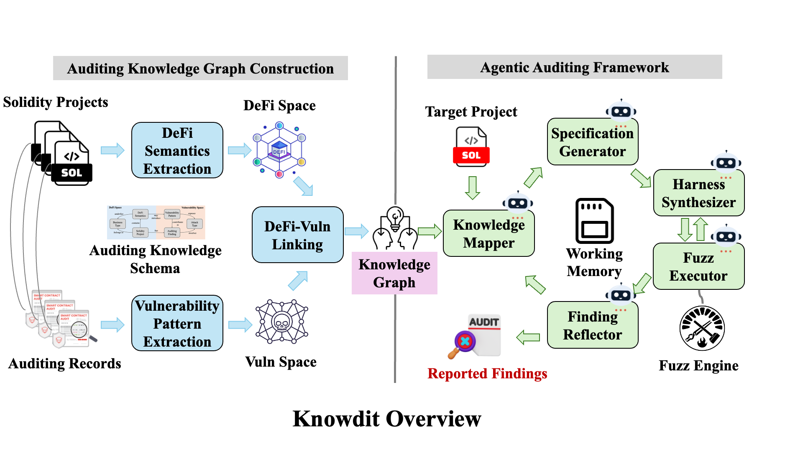

# Knowdit



Knowdit (Knowledge + Audit) is an LLM based auditing framework that rigorously reveals high severity vulnerabilities. On our [evaluation](https://arxiv.org/abs/2603.26270), Knowdit is the only tool exploiting all vulnerabilities leading to severe asset loss.

This repo serves as the artifact of our paper. Please report any issue you found in using Knowdit.

# Install

```bash
cargo install knowdit
```

or

```
git clone https://github.com/abortfuzz/knowdit
cd knowdit
cargo build --release
```

or we also have [releases](https://github.com/abortfuzz/knowdit/releases) available.

# Instructions

## Overall

In general, Knowdit summarizes **Semantic-Vulnerability Links** from historical audit projects and saves them to a __Historical Database__. Therefore, for Knowdit to scan any project, you have to "train" such a database firstly.

For given projects under auditing, Knowdit repeatly fetches such links from the __Historical Database__, which you could imagine such links like check lists, and tries to **concretize** the links on the new projects to test if the links suggest vulnerabilities. Then, it spins up `foundry` to verify the vulnerability really exists and uses a LLM based reflector to verdict if the exploit is false positive or not.

## Configure an LLM

In most cases, Knowdit needs a LLM to work. In general, all of our evaluation and testing is based on OpenAI models, like `gpt-5.1`, `gpt-5-mini`, `gpt-5.4-mini` and `gpt-5.5`. We do not offer any guarantee for performance for other models, while our underlying library [llmy](https://github.com/wtdcode/llmy) indeed supports a wide range of providers.

The most straightforward way to configure a LLM:

```
OPENAI_API_URL=...
OPENAI_API_MODEL=gpt-5.4
```

Optionally, you can setup a billing cap for your tasks:

```
OPENAI_BILLING_CAP=50
```

This ensures that Knowdit only uses no more than 50 USD worth of tokens.

[llmy](https://github.com/wtdcode/llmy) also supports saving all raw conversations by:

```
LLM_DEBUG=debug-conversation.sqlite3
```

Read [llmy](https://github.com/wtdcode/llmy) for how to dump the conversations from the database.

## Configure `forge`

For various reasons, `knowdit` currently relies on a customized `forge`. Though the canonical `forge` might work, we does not offer any guarantee.

On Linux, if `docker` exists, `knowdit` will automatically pull a docker image for fuzzing while in other cases, please download a copy of `forge` [here](https://github.com/abortfuzz/foundry/releases).

## Train a Historical Database

The knowdit cli contains several helpers to trains a __Historical Database__. Please note Knowdit _does not_ require the projects to build for training purpose.

For code4rena projects, learn it by:

```bash
./target/release/knowdit learn c4 --database-url ...
```

For other general projects, learn it by:

```bash
./target/release/knowdit learn projects --database-url ...
```

Please note the __Historcal Database__ could be saved in any relation database like `mysql` and `sqlite3`, as long as it is supported by `sea-orm`.

Let us know if you would like more project layout to be supported.

## Audit a New Project

Once the __Historical Database__ is prepared, you could scan a project by using our predefined workflow:

```bash
DATABASE_URL=... ./target/release/knowdit workflow streamloop -p ...
```

For advanced usages, we provide standalone commands for each stage of Knowdit:

```bash
> ./target/release/knowdit agentic --help
Run project-specific agentic (LLM-driven) audit workflows against a project database

Usage: knowdit agentic [OPTIONS] <COMMAND>

Commands:
  solidity           LLM-driven Solidity workflows
  extract-semantics  Select and localize semantic specifications from a scope corpus
  profile            Build a per-project ProjectProfile (domain summary, subsystems, core components, out-of-scope notes) consumed by the Knowledge Mapper. Resume-safe: skips if a profile is already cached unless `--profile-regenerate` is set
  map-semantics      Knowledge Mapper: fuzzy-match the project's extracted semantics against the historical knowledge graph and persist matched historical semantics + findings into the project database
  gen-specs          Specification Generator: for each (extract, historical, finding) link from the Knowledge Mapper, run a memory-equipped agent to derive project-specific AuditSpecifications
  fuzz               Fuzzing Harness Generator: synthesize a Foundry harness for each AuditSpecification and drive `forge` against it
  reflect            Reflection: post-fuzz triage of synthesized harnesses through the Gate 1 (static) + Gate 2 (coverage) stack, marking suspect harnesses for regen
  regen              Regen: consume the pending-reflection queue, regenerate code_gens (and, when escalated, specs) with the prior reflection feedback fed back into the agent's system prompt
  help               Print this message or the help of the given subcommand(s)
```

# Contact

Interested in any research collaboration? Would like to beat Knowdit in your paper? Let [me](https://t.me/lazymio) know.

# Cite

```bibtex
@misc{kong2026knowditagenticsmartcontract,
      title={Knowdit: Agentic Smart Contract Vulnerability Detection with Auditing Knowledge Summarization}, 
      author={Ziqiao Kong and Wanxu Xia and Chong Wang and Yi Lu and Pan Li and Shaohua Li and Zong Cao and Yang Liu},
      year={2026},
      eprint={2603.26270},
      archivePrefix={arXiv},
      primaryClass={cs.CR},
      url={https://arxiv.org/abs/2603.26270}, 
}
```